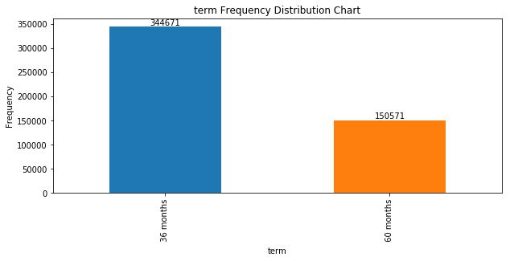
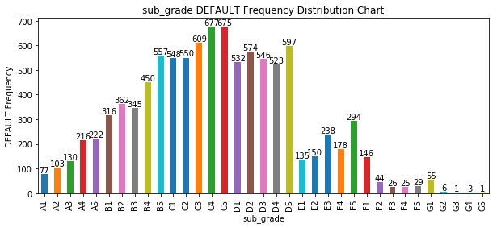
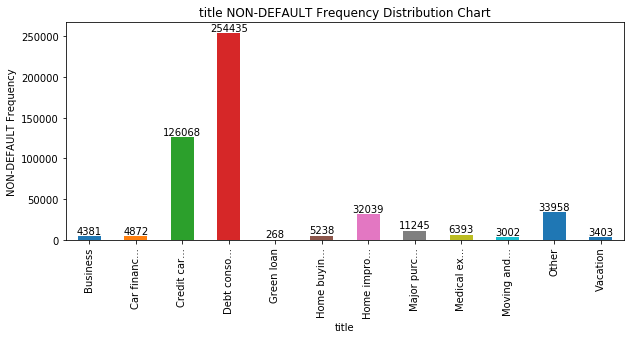

## Loan Default Classification (Lending Club Predictive Analytics)

### Dataset Information
The dataset is obtained from LendingClub Statistics: https://www.lendingclub.com/info/download-data.action


```python
import pandas as pd
import matplotlib.pyplot as plt
import seaborn as sns
import numpy as np
import scipy.stats as ss
from sklearn.model_selection import train_test_split
from sklearn.metrics import accuracy_score, classification_report, confusion_matrix, roc_curve, auc
from sklearn.externals import joblib
from sklearn.tree import DecisionTreeClassifier
from sklearn.linear_model import LogisticRegression
from xgboost import XGBClassifier, plot_importance

#pip install xgboost
#from xgboost import plot_tree
#conda install graphviz
#conda install python-graphviz

%matplotlib inline

random_seed = 170008
```


```python
# Combine multiple data files
# Specify row count to eliminate extra rows in the end of data files
quarter_row = {'2018Q1': 107864, '2018Q2': 130772, '2018Q3': 128194, '2018Q4': 128412}
filenames = ''
cnt_append = 0

for key, value in quarter_row.items():
    filename = f'LoanStats_{key}.csv'
    df_temp = pd.read_csv(f'./{filename}', skiprows=1, nrows=value, low_memory=False)
    
    if cnt_append == 0:
        df_init = df_temp.copy()
        filenames += filename
    else:
        df_init = df_init.append(df_temp, ignore_index=True)
        filenames += ', ' + filename
    
    cnt_append += 1
    
print(f'{cnt_append} data files ({filenames}) appended.')

display(df_init[:5])
print('There are %d rows and %d columns in dataframe.' % (df_init.shape))
```

    4 data files (LoanStats_2018Q1.csv, LoanStats_2018Q2.csv, LoanStats_2018Q3.csv, LoanStats_2018Q4.csv) appended.
    


<div>
<table border="1" class="dataframe">
  <thead>
    <tr style="text-align: right;">
      <th></th>
      <th>id</th>
      <th>member_id</th>
      <th>loan_amnt</th>
      <th>funded_amnt</th>
      <th>funded_amnt_inv</th>
      <th>term</th>
      <th>int_rate</th>
      <th>installment</th>
      <th>grade</th>
      <th>sub_grade</th>
      <th>...</th>
      <th>orig_projected_additional_accrued_interest</th>
      <th>hardship_payoff_balance_amount</th>
      <th>hardship_last_payment_amount</th>
      <th>debt_settlement_flag</th>
      <th>debt_settlement_flag_date</th>
      <th>settlement_status</th>
      <th>settlement_date</th>
      <th>settlement_amount</th>
      <th>settlement_percentage</th>
      <th>settlement_term</th>
    </tr>
  </thead>
  <tbody>
    <tr>
      <th>0</th>
      <td>NaN</td>
      <td>NaN</td>
      <td>25000</td>
      <td>25000</td>
      <td>25000.0</td>
      <td>60 months</td>
      <td>21.85%</td>
      <td>688.35</td>
      <td>D</td>
      <td>D5</td>
      <td>...</td>
      <td>NaN</td>
      <td>NaN</td>
      <td>NaN</td>
      <td>N</td>
      <td>NaN</td>
      <td>NaN</td>
      <td>NaN</td>
      <td>NaN</td>
      <td>NaN</td>
      <td>NaN</td>
    </tr>
    <tr>
      <th>1</th>
      <td>NaN</td>
      <td>NaN</td>
      <td>10000</td>
      <td>10000</td>
      <td>10000.0</td>
      <td>60 months</td>
      <td>12.61%</td>
      <td>225.54</td>
      <td>C</td>
      <td>C1</td>
      <td>...</td>
      <td>NaN</td>
      <td>NaN</td>
      <td>NaN</td>
      <td>N</td>
      <td>NaN</td>
      <td>NaN</td>
      <td>NaN</td>
      <td>NaN</td>
      <td>NaN</td>
      <td>NaN</td>
    </tr>
    <tr>
      <th>2</th>
      <td>NaN</td>
      <td>NaN</td>
      <td>11200</td>
      <td>11200</td>
      <td>11200.0</td>
      <td>60 months</td>
      <td>30.79%</td>
      <td>367.82</td>
      <td>G</td>
      <td>G1</td>
      <td>...</td>
      <td>NaN</td>
      <td>NaN</td>
      <td>NaN</td>
      <td>N</td>
      <td>NaN</td>
      <td>NaN</td>
      <td>NaN</td>
      <td>NaN</td>
      <td>NaN</td>
      <td>NaN</td>
    </tr>
    <tr>
      <th>3</th>
      <td>NaN</td>
      <td>NaN</td>
      <td>6500</td>
      <td>6500</td>
      <td>6500.0</td>
      <td>36 months</td>
      <td>6.07%</td>
      <td>197.95</td>
      <td>A</td>
      <td>A2</td>
      <td>...</td>
      <td>NaN</td>
      <td>NaN</td>
      <td>NaN</td>
      <td>N</td>
      <td>NaN</td>
      <td>NaN</td>
      <td>NaN</td>
      <td>NaN</td>
      <td>NaN</td>
      <td>NaN</td>
    </tr>
    <tr>
      <th>4</th>
      <td>NaN</td>
      <td>NaN</td>
      <td>6000</td>
      <td>6000</td>
      <td>6000.0</td>
      <td>36 months</td>
      <td>10.41%</td>
      <td>194.77</td>
      <td>B</td>
      <td>B3</td>
      <td>...</td>
      <td>NaN</td>
      <td>NaN</td>
      <td>NaN</td>
      <td>N</td>
      <td>NaN</td>
      <td>NaN</td>
      <td>NaN</td>
      <td>NaN</td>
      <td>NaN</td>
      <td>NaN</td>
    </tr>
  </tbody>
</table>
<p>5 rows × 144 columns</p>
</div>


    There are 495242 rows and 144 columns in dataframe.
    


```python
# Work on a copy of the dataframe so that don't have to reload the dataset
df = df_init.copy()
```


```python
# Function to check columns for missing values
def check_null(df):
    col_dtype = df.dtypes
    null_val_num = df.isnull().sum()
    null_val_perc = round(null_val_num / df.shape[0] * 100, 2)
    
    df_null_val = pd.concat([col_dtype, null_val_num, null_val_perc], axis=1, sort=True).rename(
        columns={0: 'Data Type', 1: 'Null Values (#)', 2: 'Null Values (%)'})
    df_null_val = df_null_val.sort_values('Null Values (#)', ascending=False)
    
    cnt_null_col = df_null_val[df_null_val['Null Values (#)'] != 0].shape[0]
    print(f'Dataframe has {df.shape[1]} columns, {cnt_null_col} of them have missing values.')
    
    return df_null_val
```


```python
# Missing value statistics
df_null_val = check_null(df)

display(df_null_val[df_null_val['Null Values (#)'] != 0])
```

    Dataframe has 144 columns, 62 of them have missing values.
    


<div>
<table border="1" class="dataframe">
  <thead>
    <tr style="text-align: right;">
      <th></th>
      <th>Data Type</th>
      <th>Null Values (#)</th>
      <th>Null Values (%)</th>
    </tr>
  </thead>
  <tbody>
    <tr>
      <th>desc</th>
      <td>float64</td>
      <td>495242</td>
      <td>100.00</td>
    </tr>
    <tr>
      <th>member_id</th>
      <td>float64</td>
      <td>495242</td>
      <td>100.00</td>
    </tr>
    <tr>
      <th>id</th>
      <td>float64</td>
      <td>495242</td>
      <td>100.00</td>
    </tr>
    <tr>
      <th>url</th>
      <td>float64</td>
      <td>495242</td>
      <td>100.00</td>
    </tr>
    <tr>
      <th>orig_projected_additional_accrued_interest</th>
      <td>float64</td>
      <td>494867</td>
      <td>99.92</td>
    </tr>
    <tr>
      <th>hardship_type</th>
      <td>object</td>
      <td>494804</td>
      <td>99.91</td>
    </tr>
    <tr>
      <th>hardship_status</th>
      <td>object</td>
      <td>494804</td>
      <td>99.91</td>
    </tr>
    <tr>
      <th>hardship_start_date</th>
      <td>object</td>
      <td>494804</td>
      <td>99.91</td>
    </tr>
    <tr>
      <th>hardship_payoff_balance_amount</th>
      <td>float64</td>
      <td>494804</td>
      <td>99.91</td>
    </tr>
    <tr>
      <th>hardship_loan_status</th>
      <td>object</td>
      <td>494804</td>
      <td>99.91</td>
    </tr>
    <tr>
      <th>hardship_length</th>
      <td>float64</td>
      <td>494804</td>
      <td>99.91</td>
    </tr>
    <tr>
      <th>hardship_last_payment_amount</th>
      <td>float64</td>
      <td>494804</td>
      <td>99.91</td>
    </tr>
    <tr>
      <th>hardship_end_date</th>
      <td>object</td>
      <td>494804</td>
      <td>99.91</td>
    </tr>
    <tr>
      <th>hardship_dpd</th>
      <td>float64</td>
      <td>494804</td>
      <td>99.91</td>
    </tr>
    <tr>
      <th>hardship_amount</th>
      <td>float64</td>
      <td>494804</td>
      <td>99.91</td>
    </tr>
    <tr>
      <th>hardship_reason</th>
      <td>object</td>
      <td>494804</td>
      <td>99.91</td>
    </tr>
    <tr>
      <th>payment_plan_start_date</th>
      <td>object</td>
      <td>494804</td>
      <td>99.91</td>
    </tr>
    <tr>
      <th>deferral_term</th>
      <td>float64</td>
      <td>494804</td>
      <td>99.91</td>
    </tr>
    <tr>
      <th>settlement_date</th>
      <td>object</td>
      <td>494624</td>
      <td>99.88</td>
    </tr>
    <tr>
      <th>settlement_percentage</th>
      <td>float64</td>
      <td>494624</td>
      <td>99.88</td>
    </tr>
    <tr>
      <th>debt_settlement_flag_date</th>
      <td>object</td>
      <td>494624</td>
      <td>99.88</td>
    </tr>
    <tr>
      <th>settlement_status</th>
      <td>object</td>
      <td>494624</td>
      <td>99.88</td>
    </tr>
    <tr>
      <th>settlement_amount</th>
      <td>float64</td>
      <td>494624</td>
      <td>99.88</td>
    </tr>
    <tr>
      <th>settlement_term</th>
      <td>float64</td>
      <td>494624</td>
      <td>99.88</td>
    </tr>
    <tr>
      <th>sec_app_mths_since_last_major_derog</th>
      <td>float64</td>
      <td>472865</td>
      <td>95.48</td>
    </tr>
    <tr>
      <th>mths_since_last_record</th>
      <td>float64</td>
      <td>432258</td>
      <td>87.28</td>
    </tr>
    <tr>
      <th>verification_status_joint</th>
      <td>object</td>
      <td>431231</td>
      <td>87.07</td>
    </tr>
    <tr>
      <th>sec_app_revol_util</th>
      <td>float64</td>
      <td>427454</td>
      <td>86.31</td>
    </tr>
    <tr>
      <th>revol_bal_joint</th>
      <td>float64</td>
      <td>426257</td>
      <td>86.07</td>
    </tr>
    <tr>
      <th>annual_inc_joint</th>
      <td>float64</td>
      <td>426257</td>
      <td>86.07</td>
    </tr>
    <tr>
      <th>...</th>
      <td>...</td>
      <td>...</td>
      <td>...</td>
    </tr>
    <tr>
      <th>sec_app_inq_last_6mths</th>
      <td>float64</td>
      <td>426257</td>
      <td>86.07</td>
    </tr>
    <tr>
      <th>sec_app_chargeoff_within_12_mths</th>
      <td>float64</td>
      <td>426257</td>
      <td>86.07</td>
    </tr>
    <tr>
      <th>sec_app_earliest_cr_line</th>
      <td>object</td>
      <td>426257</td>
      <td>86.07</td>
    </tr>
    <tr>
      <th>sec_app_open_act_il</th>
      <td>float64</td>
      <td>426257</td>
      <td>86.07</td>
    </tr>
    <tr>
      <th>sec_app_open_acc</th>
      <td>float64</td>
      <td>426257</td>
      <td>86.07</td>
    </tr>
    <tr>
      <th>dti_joint</th>
      <td>float64</td>
      <td>426257</td>
      <td>86.07</td>
    </tr>
    <tr>
      <th>sec_app_collections_12_mths_ex_med</th>
      <td>float64</td>
      <td>426257</td>
      <td>86.07</td>
    </tr>
    <tr>
      <th>mths_since_recent_bc_dlq</th>
      <td>float64</td>
      <td>397132</td>
      <td>80.19</td>
    </tr>
    <tr>
      <th>mths_since_last_major_derog</th>
      <td>float64</td>
      <td>380409</td>
      <td>76.81</td>
    </tr>
    <tr>
      <th>mths_since_recent_revol_delinq</th>
      <td>float64</td>
      <td>352552</td>
      <td>71.19</td>
    </tr>
    <tr>
      <th>mths_since_last_delinq</th>
      <td>float64</td>
      <td>276652</td>
      <td>55.86</td>
    </tr>
    <tr>
      <th>il_util</th>
      <td>float64</td>
      <td>80824</td>
      <td>16.32</td>
    </tr>
    <tr>
      <th>mths_since_recent_inq</th>
      <td>float64</td>
      <td>61305</td>
      <td>12.38</td>
    </tr>
    <tr>
      <th>next_pymnt_d</th>
      <td>object</td>
      <td>61190</td>
      <td>12.36</td>
    </tr>
    <tr>
      <th>emp_title</th>
      <td>object</td>
      <td>54659</td>
      <td>11.04</td>
    </tr>
    <tr>
      <th>emp_length</th>
      <td>object</td>
      <td>41987</td>
      <td>8.48</td>
    </tr>
    <tr>
      <th>mths_since_rcnt_il</th>
      <td>float64</td>
      <td>18410</td>
      <td>3.72</td>
    </tr>
    <tr>
      <th>mo_sin_old_il_acct</th>
      <td>float64</td>
      <td>18410</td>
      <td>3.72</td>
    </tr>
    <tr>
      <th>num_tl_120dpd_2m</th>
      <td>float64</td>
      <td>12404</td>
      <td>2.50</td>
    </tr>
    <tr>
      <th>bc_util</th>
      <td>float64</td>
      <td>6803</td>
      <td>1.37</td>
    </tr>
    <tr>
      <th>percent_bc_gt_75</th>
      <td>float64</td>
      <td>6596</td>
      <td>1.33</td>
    </tr>
    <tr>
      <th>bc_open_to_buy</th>
      <td>float64</td>
      <td>6588</td>
      <td>1.33</td>
    </tr>
    <tr>
      <th>mths_since_recent_bc</th>
      <td>float64</td>
      <td>6198</td>
      <td>1.25</td>
    </tr>
    <tr>
      <th>dti</th>
      <td>float64</td>
      <td>1132</td>
      <td>0.23</td>
    </tr>
    <tr>
      <th>last_pymnt_d</th>
      <td>object</td>
      <td>637</td>
      <td>0.13</td>
    </tr>
    <tr>
      <th>revol_util</th>
      <td>object</td>
      <td>592</td>
      <td>0.12</td>
    </tr>
    <tr>
      <th>all_util</th>
      <td>float64</td>
      <td>129</td>
      <td>0.03</td>
    </tr>
    <tr>
      <th>avg_cur_bal</th>
      <td>float64</td>
      <td>40</td>
      <td>0.01</td>
    </tr>
    <tr>
      <th>last_credit_pull_d</th>
      <td>object</td>
      <td>5</td>
      <td>0.00</td>
    </tr>
    <tr>
      <th>pct_tl_nvr_dlq</th>
      <td>float64</td>
      <td>2</td>
      <td>0.00</td>
    </tr>
  </tbody>
</table>
<p>62 rows × 3 columns</p>
</div>


```python
# Drop columns with more than 70% missing value
col_null = df_null_val[df_null_val['Null Values (%)'] > 70].index.tolist()
df = df.drop(columns=col_null)
print(f'{len(col_null)} columns dropped.')

display(df[:5])
print('There are %d rows and %d columns in dataframe.' % (df.shape))
```

    42 columns dropped.
    


<div>
<table border="1" class="dataframe">
  <thead>
    <tr style="text-align: right;">
      <th></th>
      <th>loan_amnt</th>
      <th>funded_amnt</th>
      <th>funded_amnt_inv</th>
      <th>term</th>
      <th>int_rate</th>
      <th>installment</th>
      <th>grade</th>
      <th>sub_grade</th>
      <th>emp_title</th>
      <th>emp_length</th>
      <th>...</th>
      <th>pct_tl_nvr_dlq</th>
      <th>percent_bc_gt_75</th>
      <th>pub_rec_bankruptcies</th>
      <th>tax_liens</th>
      <th>tot_hi_cred_lim</th>
      <th>total_bal_ex_mort</th>
      <th>total_bc_limit</th>
      <th>total_il_high_credit_limit</th>
      <th>hardship_flag</th>
      <th>debt_settlement_flag</th>
    </tr>
  </thead>
  <tbody>
    <tr>
      <th>0</th>
      <td>25000</td>
      <td>25000</td>
      <td>25000.0</td>
      <td>60 months</td>
      <td>21.85%</td>
      <td>688.35</td>
      <td>D</td>
      <td>D5</td>
      <td>Asphalt Supervisor</td>
      <td>10+ years</td>
      <td>...</td>
      <td>75.0</td>
      <td>100.0</td>
      <td>0</td>
      <td>0</td>
      <td>101234</td>
      <td>17039</td>
      <td>3300</td>
      <td>10220</td>
      <td>N</td>
      <td>N</td>
    </tr>
    <tr>
      <th>1</th>
      <td>10000</td>
      <td>10000</td>
      <td>10000.0</td>
      <td>60 months</td>
      <td>12.61%</td>
      <td>225.54</td>
      <td>C</td>
      <td>C1</td>
      <td>Supervisor</td>
      <td>4 years</td>
      <td>...</td>
      <td>91.3</td>
      <td>40.0</td>
      <td>0</td>
      <td>0</td>
      <td>388400</td>
      <td>10710</td>
      <td>12500</td>
      <td>0</td>
      <td>N</td>
      <td>N</td>
    </tr>
    <tr>
      <th>2</th>
      <td>11200</td>
      <td>11200</td>
      <td>11200.0</td>
      <td>60 months</td>
      <td>30.79%</td>
      <td>367.82</td>
      <td>G</td>
      <td>G1</td>
      <td>Client services</td>
      <td>&lt; 1 year</td>
      <td>...</td>
      <td>71.4</td>
      <td>0.0</td>
      <td>0</td>
      <td>0</td>
      <td>80367</td>
      <td>67173</td>
      <td>1900</td>
      <td>74167</td>
      <td>N</td>
      <td>N</td>
    </tr>
    <tr>
      <th>3</th>
      <td>6500</td>
      <td>6500</td>
      <td>6500.0</td>
      <td>36 months</td>
      <td>6.07%</td>
      <td>197.95</td>
      <td>A</td>
      <td>A2</td>
      <td>dental assistant</td>
      <td>10+ years</td>
      <td>...</td>
      <td>93.8</td>
      <td>20.0</td>
      <td>0</td>
      <td>0</td>
      <td>289008</td>
      <td>8665</td>
      <td>39000</td>
      <td>6500</td>
      <td>N</td>
      <td>N</td>
    </tr>
    <tr>
      <th>4</th>
      <td>6000</td>
      <td>6000</td>
      <td>6000.0</td>
      <td>36 months</td>
      <td>10.41%</td>
      <td>194.77</td>
      <td>B</td>
      <td>B3</td>
      <td>Dental Hygienist</td>
      <td>1 year</td>
      <td>...</td>
      <td>100.0</td>
      <td>50.0</td>
      <td>0</td>
      <td>0</td>
      <td>31925</td>
      <td>17000</td>
      <td>5200</td>
      <td>13125</td>
      <td>N</td>
      <td>N</td>
    </tr>
  </tbody>
</table>
<p>5 rows × 102 columns</p>
</div>


    There are 495242 rows and 102 columns in dataframe.
    


```python
# Label continuous, categorical, unnecessary and target variables
# Continuous variables
var_contns = ['loan_amnt', 'funded_amnt', 'funded_amnt_inv', 'int_rate', 'installment',
              'annual_inc', 'dti', 'delinq_2yrs', 'inq_last_6mths', 'mths_since_last_delinq',
              'open_acc', 'pub_rec', 'revol_bal', 'revol_util', 'total_acc',
              'out_prncp', 'out_prncp_inv', 'total_pymnt', 'total_pymnt_inv', 'total_rec_prncp',
              'total_rec_int', 'total_rec_late_fee', 'recoveries', 'collection_recovery_fee', 'last_pymnt_amnt',
              'collections_12_mths_ex_med', 'acc_now_delinq', 'tot_coll_amt', 'tot_cur_bal', 'open_acc_6m',
              'open_act_il', 'open_il_12m', 'open_il_24m', 'mths_since_rcnt_il', 'total_bal_il',
              'il_util', 'open_rv_12m', 'open_rv_24m', 'max_bal_bc', 'all_util',
              'total_rev_hi_lim', 'inq_fi', 'total_cu_tl', 'inq_last_12m', 'acc_open_past_24mths',
              'avg_cur_bal', 'bc_open_to_buy', 'bc_util', 'chargeoff_within_12_mths', 'delinq_amnt',
              'mo_sin_old_il_acct', 'mo_sin_old_rev_tl_op', 'mo_sin_rcnt_rev_tl_op', 'mo_sin_rcnt_tl', 'mort_acc',
              'mths_since_recent_bc', 'mths_since_recent_inq', 'num_accts_ever_120_pd', 'num_actv_bc_tl', 'num_actv_rev_tl',
              'num_bc_sats', 'num_bc_tl', 'num_il_tl', 'num_op_rev_tl', 'num_rev_accts',
              'num_rev_tl_bal_gt_0', 'num_sats', 'num_tl_30dpd', 'num_tl_90g_dpd_24m', 'num_tl_op_past_12m',
              'pct_tl_nvr_dlq', 'percent_bc_gt_75', 'pub_rec_bankruptcies', 'tax_liens', 'tot_hi_cred_lim',
              'total_bal_ex_mort', 'total_bc_limit', 'total_il_high_credit_limit']

# Categorical variables
var_ctgry = ['term', 'grade', 'sub_grade', 'emp_length', 'home_ownership',
             'verification_status', 'pymnt_plan', 'purpose', 'title', 'initial_list_status',
             'application_type', 'hardship_flag', 'debt_settlement_flag']

# Unnecessary variables
var_drop = ['emp_title', 'zip_code', 'addr_state', # Too many categories
            'issue_d', 'earliest_cr_line', 'last_pymnt_d', 'next_pymnt_d', 'last_credit_pull_d', # Date
            'policy_code', # Only single category
            'num_tl_120dpd_2m' # Only single or missing value
           ]

# Target variable
var_target = 'loan_status'
```


```python
# Display emp_title categories
display(df['emp_title'].value_counts())
```


    Teacher                                8679
    Manager                                8008
    Owner                                  5481
    Driver                                 4308
    Registered Nurse                       3633
    Supervisor                             3067
    RN                                     2981
    Sales                                  2919
    Project Manager                        2315
    Office Manager                         2219
    General Manager                        2027
    Director                               1802
    owner                                  1680
    Engineer                               1525
    President                              1505
    Truck Driver                           1415
    Operations Manager                     1404
    Nurse                                  1358
    manager                                1259
    Accountant                             1197
    Sales Manager                          1186
    Supervisor                             1183
    Server                                 1182
    teacher                                1170
    Administrative Assistant               1146
    Technician                             1079
    Vice President                         1056
    Manager                                1017
    Mechanic                               1007
    Account Manager                        1002
                                           ... 
    Specialized Manager                       1
    VP & General Manager                      1
    Beneficiary Services Rel                  1
    Insurance and Billing Coordinator         1
    Sr Applications / Systems Engineer        1
    Sr. HR Assistant                          1
    Boat sales                                1
    Claim Manager                             1
    Late State Collections                    1
    Parts Caster                              1
    Floor Representative                      1
    Contract Service Specialist               1
    Office Assisrant II                       1
    Managers Assistant                        1
    coating tec                               1
    Assay Lab Tech                            1
    Registry Physical Therapist               1
    Nurse Manager of Labor and Delivery       1
    OR Sterile Processor                      1
    Ac tech                                   1
    Family Medicine Resident                  1
    HVAC Teck                                 1
    Supervising Field Auditor                 1
    owner, agent                              1
    Sr. Paralegal to General Counsel          1
    CareTaker                                 1
    Records Integration Coordinator           1
    Front manger                              1
    Campus Administrative Assistant           1
    Site Attendant                            1
    Name: emp_title, Length: 129449, dtype: int64


```python
# Drop unnecessary variables
df = df.drop(columns=var_drop)
print(f'{len(var_drop)} columns dropped.')

display(df[:5])
print('There are %d rows and %d columns in dataframe.' % (df.shape))
```

    10 columns dropped.
    


<div>
<table border="1" class="dataframe">
  <thead>
    <tr style="text-align: right;">
      <th></th>
      <th>loan_amnt</th>
      <th>funded_amnt</th>
      <th>funded_amnt_inv</th>
      <th>term</th>
      <th>int_rate</th>
      <th>installment</th>
      <th>grade</th>
      <th>sub_grade</th>
      <th>emp_length</th>
      <th>home_ownership</th>
      <th>...</th>
      <th>pct_tl_nvr_dlq</th>
      <th>percent_bc_gt_75</th>
      <th>pub_rec_bankruptcies</th>
      <th>tax_liens</th>
      <th>tot_hi_cred_lim</th>
      <th>total_bal_ex_mort</th>
      <th>total_bc_limit</th>
      <th>total_il_high_credit_limit</th>
      <th>hardship_flag</th>
      <th>debt_settlement_flag</th>
    </tr>
  </thead>
  <tbody>
    <tr>
      <th>0</th>
      <td>25000</td>
      <td>25000</td>
      <td>25000.0</td>
      <td>60 months</td>
      <td>21.85%</td>
      <td>688.35</td>
      <td>D</td>
      <td>D5</td>
      <td>10+ years</td>
      <td>MORTGAGE</td>
      <td>...</td>
      <td>75.0</td>
      <td>100.0</td>
      <td>0</td>
      <td>0</td>
      <td>101234</td>
      <td>17039</td>
      <td>3300</td>
      <td>10220</td>
      <td>N</td>
      <td>N</td>
    </tr>
    <tr>
      <th>1</th>
      <td>10000</td>
      <td>10000</td>
      <td>10000.0</td>
      <td>60 months</td>
      <td>12.61%</td>
      <td>225.54</td>
      <td>C</td>
      <td>C1</td>
      <td>4 years</td>
      <td>MORTGAGE</td>
      <td>...</td>
      <td>91.3</td>
      <td>40.0</td>
      <td>0</td>
      <td>0</td>
      <td>388400</td>
      <td>10710</td>
      <td>12500</td>
      <td>0</td>
      <td>N</td>
      <td>N</td>
    </tr>
    <tr>
      <th>2</th>
      <td>11200</td>
      <td>11200</td>
      <td>11200.0</td>
      <td>60 months</td>
      <td>30.79%</td>
      <td>367.82</td>
      <td>G</td>
      <td>G1</td>
      <td>&lt; 1 year</td>
      <td>RENT</td>
      <td>...</td>
      <td>71.4</td>
      <td>0.0</td>
      <td>0</td>
      <td>0</td>
      <td>80367</td>
      <td>67173</td>
      <td>1900</td>
      <td>74167</td>
      <td>N</td>
      <td>N</td>
    </tr>
    <tr>
      <th>3</th>
      <td>6500</td>
      <td>6500</td>
      <td>6500.0</td>
      <td>36 months</td>
      <td>6.07%</td>
      <td>197.95</td>
      <td>A</td>
      <td>A2</td>
      <td>10+ years</td>
      <td>MORTGAGE</td>
      <td>...</td>
      <td>93.8</td>
      <td>20.0</td>
      <td>0</td>
      <td>0</td>
      <td>289008</td>
      <td>8665</td>
      <td>39000</td>
      <td>6500</td>
      <td>N</td>
      <td>N</td>
    </tr>
    <tr>
      <th>4</th>
      <td>6000</td>
      <td>6000</td>
      <td>6000.0</td>
      <td>36 months</td>
      <td>10.41%</td>
      <td>194.77</td>
      <td>B</td>
      <td>B3</td>
      <td>1 year</td>
      <td>RENT</td>
      <td>...</td>
      <td>100.0</td>
      <td>50.0</td>
      <td>0</td>
      <td>0</td>
      <td>31925</td>
      <td>17000</td>
      <td>5200</td>
      <td>13125</td>
      <td>N</td>
      <td>N</td>
    </tr>
  </tbody>
</table>
<p>5 rows × 92 columns</p>
</div>


    There are 495242 rows and 92 columns in dataframe.
    


```python
# Convert string type continuous variables to numeric
print('Before conversion:')
display(df.loc[:4, ['int_rate', 'revol_util']])

# int_rate
df['int_rate'] = round(pd.Series([x[:-1] for x in df['int_rate']]).astype('float64') / 100, 4)

# revol_util
df['revol_util'] = round(pd.Series([x[:-1] if isinstance(x, str) else x
                       for x in df.loc[~df['revol_util'].isnull(), 'revol_util']]).astype('float64') / 100, 3)

print('After conversion:')
display(df.loc[:4, ['int_rate', 'revol_util']])
```

    Before conversion:
    


<div>
<table border="1" class="dataframe">
  <thead>
    <tr style="text-align: right;">
      <th></th>
      <th>int_rate</th>
      <th>revol_util</th>
    </tr>
  </thead>
  <tbody>
    <tr>
      <th>0</th>
      <td>21.85%</td>
      <td>98.4%</td>
    </tr>
    <tr>
      <th>1</th>
      <td>12.61%</td>
      <td>37.7%</td>
    </tr>
    <tr>
      <th>2</th>
      <td>30.79%</td>
      <td>24.6%</td>
    </tr>
    <tr>
      <th>3</th>
      <td>6.07%</td>
      <td>20.2%</td>
    </tr>
    <tr>
      <th>4</th>
      <td>10.41%</td>
      <td>29.6%</td>
    </tr>
  </tbody>
</table>
</div>


    After conversion:
    


<div>
<table border="1" class="dataframe">
  <thead>
    <tr style="text-align: right;">
      <th></th>
      <th>int_rate</th>
      <th>revol_util</th>
    </tr>
  </thead>
  <tbody>
    <tr>
      <th>0</th>
      <td>0.2185</td>
      <td>0.984</td>
    </tr>
    <tr>
      <th>1</th>
      <td>0.1261</td>
      <td>0.377</td>
    </tr>
    <tr>
      <th>2</th>
      <td>0.3079</td>
      <td>0.246</td>
    </tr>
    <tr>
      <th>3</th>
      <td>0.0607</td>
      <td>0.202</td>
    </tr>
    <tr>
      <th>4</th>
      <td>0.1041</td>
      <td>0.296</td>
    </tr>
  </tbody>
</table>
</div>


```python
# Create target variable (1 - 'DEFAULT', 0 - 'NON-DEFAULT')
target_list = ['DEFAULT' if x in ['Default', 'Charged Off'] else 'NON-DEFAULT' for x in df['loan_status']]
target_dict = {'DEFAULT': 1, 'NON-DEFAULT': 0}

df['TARGET'] = target_list
display(df['TARGET'].value_counts())
```


    NON-DEFAULT    485302
    DEFAULT          9940
    Name: TARGET, dtype: int64


```python
# Function to add value labels on a matplotlib bar chart
# Refer to https://stackoverflow.com/questions/28931224/adding-value-labels-on-a-matplotlib-bar-chart
def add_value_labels(ax, spacing=0):
    """Add labels to the end of each bar in a bar chart.

    Arguments:
        ax (matplotlib.axes.Axes): The matplotlib object containing the axes
            of the plot to annotate.
        spacing (int): The distance between the labels and the bars.
    """

    # For each bar: Place a label
    for rect in ax.patches:
        # Get X and Y placement of label from rect.
        y_value = rect.get_height()
        x_value = rect.get_x() + rect.get_width() / 2

        # Number of points between bar and label. Change to your liking.
        space = spacing
        # Vertical alignment for positive values
        va = 'bottom'

        # If value of bar is negative: Place label below bar
        if y_value < 0:
            # Invert space to place label below
            space *= -1
            # Vertically align label at top
            va = 'top'

        # Use Y value as label and format number with one decimal place
        #label = "{:.1f}".format(y_value)
        label = y_value

        # Create annotation
        ax.annotate(
            label,                      # Use `label` as label
            (x_value, y_value),         # Place label at end of the bar
            xytext=(0, space),          # Vertically shift label by `space`
            textcoords="offset points", # Interpret `xytext` as offset in points
            ha='center',                # Horizontally center label
            va=va)                      # Vertically align label differently for
                                        # positive and negative values.
```


```python
# Display Frequency Distribution Chart of each categorical variable
for var in ['TARGET', var_target] + var_ctgry:
    plt.figure(figsize=[10, 4])
    ax = df[var].value_counts().sort_index().plot(kind='bar')
    ax.set_title(f'{var} Frequency Distribution Chart')
    ax.set_xlabel(f'{var}')
    ax.set_ylabel('Frequency')
    ax.set_xticklabels([x[:10] + '...' if len(x) > 10 else x for x in sorted(
        df[var].value_counts().index)])
    add_value_labels(ax)
    plt.show()
```





```python
# Display Descriptive Statistics Table of continuous variables
df_desc_stat = df[var_contns].describe().T
df_desc_stat = df_desc_stat.drop(columns=['count'])
df_desc_stat = round(df_desc_stat, 2)

display(df_desc_stat[:5])
print(f'Dataframe has {df_desc_stat.shape[0]} continuous variables with {df_desc_stat.shape[1]} measures.')
```


<div>
<table border="1" class="dataframe">
  <thead>
    <tr style="text-align: right;">
      <th></th>
      <th>mean</th>
      <th>std</th>
      <th>min</th>
      <th>25%</th>
      <th>50%</th>
      <th>75%</th>
      <th>max</th>
    </tr>
  </thead>
  <tbody>
    <tr>
      <th>loan_amnt</th>
      <td>16025.02</td>
      <td>10138.08</td>
      <td>1000.00</td>
      <td>8000.00</td>
      <td>14000.00</td>
      <td>22000.00</td>
      <td>40000.00</td>
    </tr>
    <tr>
      <th>funded_amnt</th>
      <td>16025.02</td>
      <td>10138.08</td>
      <td>1000.00</td>
      <td>8000.00</td>
      <td>14000.00</td>
      <td>22000.00</td>
      <td>40000.00</td>
    </tr>
    <tr>
      <th>funded_amnt_inv</th>
      <td>16021.67</td>
      <td>10137.90</td>
      <td>725.00</td>
      <td>8000.00</td>
      <td>14000.00</td>
      <td>22000.00</td>
      <td>40000.00</td>
    </tr>
    <tr>
      <th>int_rate</th>
      <td>0.13</td>
      <td>0.05</td>
      <td>0.05</td>
      <td>0.08</td>
      <td>0.12</td>
      <td>0.16</td>
      <td>0.31</td>
    </tr>
    <tr>
      <th>installment</th>
      <td>466.61</td>
      <td>286.91</td>
      <td>29.76</td>
      <td>254.56</td>
      <td>386.82</td>
      <td>629.04</td>
      <td>1670.15</td>
    </tr>
  </tbody>
</table>
</div>


    Dataframe has 78 continuous variables with 7 measures.
    


```python
# Pearson correlation analysis between TARGET and continuous variables
# Convert TARGET to numeric type for calculating correlation
df['TARGET'] = df['TARGET'].replace(target_dict)

df_contns_corr = pd.DataFrame(round(df[var_contns + ['TARGET']].corr()['TARGET']
    .sort_values(ascending=False), 4)).rename(columns={'TARGET': 'Corr. Coef.'})
df_contns_corr = df_contns_corr.loc[(df_contns_corr.index != 'TARGET')]

df_contns_pos_corr = df_contns_corr[:10]
print('Top 10 TARGET +ve Correlated Continuous Variables:')
display(df_contns_pos_corr)

df_contns_neg_corr = df_contns_corr[-10:].sort_values('Corr. Coef.')
print('Top 10 TARGET -ve Correlated Continuous Variables:')
display(df_contns_neg_corr)
```

    Top 10 TARGET +ve Correlated Continuous Variables:
    


<div>
<table border="1" class="dataframe">
  <thead>
    <tr style="text-align: right;">
      <th></th>
      <th>Corr. Coef.</th>
    </tr>
  </thead>
  <tbody>
    <tr>
      <th>recoveries</th>
      <td>0.3634</td>
    </tr>
    <tr>
      <th>collection_recovery_fee</th>
      <td>0.3580</td>
    </tr>
    <tr>
      <th>int_rate</th>
      <td>0.0963</td>
    </tr>
    <tr>
      <th>total_rec_late_fee</th>
      <td>0.0588</td>
    </tr>
    <tr>
      <th>inq_last_6mths</th>
      <td>0.0462</td>
    </tr>
    <tr>
      <th>inq_last_12m</th>
      <td>0.0401</td>
    </tr>
    <tr>
      <th>num_tl_op_past_12m</th>
      <td>0.0297</td>
    </tr>
    <tr>
      <th>open_acc_6m</th>
      <td>0.0264</td>
    </tr>
    <tr>
      <th>acc_open_past_24mths</th>
      <td>0.0260</td>
    </tr>
    <tr>
      <th>inq_fi</th>
      <td>0.0249</td>
    </tr>
  </tbody>
</table>
</div>


    Top 10 TARGET -ve Correlated Continuous Variables:
    


<div>
<table border="1" class="dataframe">
  <thead>
    <tr style="text-align: right;">
      <th></th>
      <th>Corr. Coef.</th>
    </tr>
  </thead>
  <tbody>
    <tr>
      <th>out_prncp</th>
      <td>-0.1743</td>
    </tr>
    <tr>
      <th>out_prncp_inv</th>
      <td>-0.1742</td>
    </tr>
    <tr>
      <th>total_rec_prncp</th>
      <td>-0.0716</td>
    </tr>
    <tr>
      <th>total_pymnt_inv</th>
      <td>-0.0625</td>
    </tr>
    <tr>
      <th>total_pymnt</th>
      <td>-0.0625</td>
    </tr>
    <tr>
      <th>total_rec_int</th>
      <td>-0.0382</td>
    </tr>
    <tr>
      <th>mths_since_recent_inq</th>
      <td>-0.0375</td>
    </tr>
    <tr>
      <th>last_pymnt_amnt</th>
      <td>-0.0354</td>
    </tr>
    <tr>
      <th>tot_hi_cred_lim</th>
      <td>-0.0259</td>
    </tr>
    <tr>
      <th>total_bc_limit</th>
      <td>-0.0240</td>
    </tr>
  </tbody>
</table>
</div>


```python
# Plot correlation matrix of TARGET and continuous variables
# Top 20 correlated continuous variables
var_contns_corr = df_contns_pos_corr.index.tolist() + df_contns_neg_corr.index.tolist()

plt.figure(figsize=[15, 10])
sns.heatmap(df[var_contns_corr + ['TARGET']].corr(), annot=True, fmt='.2f')
plt.title('Continuous Variable Correlation Matrix')
plt.xticks(rotation=90)
plt.yticks(rotation=0)
plt.show()
```


```python
# Display DEFAULT Descriptive Statistics Table of top 20 correlated continuous variables
df_desc_stat_default = df.loc[df['TARGET'] == 1, var_contns_corr].describe().T
df_desc_stat_default = df_desc_stat_default.drop(columns=['count'])
df_desc_stat_default = round(df_desc_stat_default, 2)

display(df_desc_stat_default)
print(f'Dataframe has {df_desc_stat_default.shape[0]} continuous variables with ' +
      f'{df_desc_stat_default.shape[1]} measures.')
```


<div>
<table border="1" class="dataframe">
  <thead>
    <tr style="text-align: right;">
      <th></th>
      <th>mean</th>
      <th>std</th>
      <th>min</th>
      <th>25%</th>
      <th>50%</th>
      <th>75%</th>
      <th>max</th>
    </tr>
  </thead>
  <tbody>
    <tr>
      <th>recoveries</th>
      <td>510.57</td>
      <td>1295.64</td>
      <td>0.00</td>
      <td>0.00</td>
      <td>0.00</td>
      <td>0.00</td>
      <td>33122.07</td>
    </tr>
    <tr>
      <th>collection_recovery_fee</th>
      <td>88.59</td>
      <td>228.73</td>
      <td>0.00</td>
      <td>0.00</td>
      <td>0.00</td>
      <td>0.00</td>
      <td>5961.97</td>
    </tr>
    <tr>
      <th>int_rate</th>
      <td>0.16</td>
      <td>0.06</td>
      <td>0.05</td>
      <td>0.12</td>
      <td>0.15</td>
      <td>0.20</td>
      <td>0.31</td>
    </tr>
    <tr>
      <th>total_rec_late_fee</th>
      <td>3.10</td>
      <td>13.09</td>
      <td>0.00</td>
      <td>0.00</td>
      <td>0.00</td>
      <td>0.00</td>
      <td>304.55</td>
    </tr>
    <tr>
      <th>inq_last_6mths</th>
      <td>0.68</td>
      <td>0.87</td>
      <td>0.00</td>
      <td>0.00</td>
      <td>0.00</td>
      <td>1.00</td>
      <td>5.00</td>
    </tr>
    <tr>
      <th>inq_last_12m</th>
      <td>2.60</td>
      <td>2.89</td>
      <td>0.00</td>
      <td>1.00</td>
      <td>2.00</td>
      <td>4.00</td>
      <td>40.00</td>
    </tr>
    <tr>
      <th>num_tl_op_past_12m</th>
      <td>2.42</td>
      <td>2.06</td>
      <td>0.00</td>
      <td>1.00</td>
      <td>2.00</td>
      <td>3.00</td>
      <td>16.00</td>
    </tr>
    <tr>
      <th>open_acc_6m</th>
      <td>1.10</td>
      <td>1.25</td>
      <td>0.00</td>
      <td>0.00</td>
      <td>1.00</td>
      <td>2.00</td>
      <td>11.00</td>
    </tr>
    <tr>
      <th>acc_open_past_24mths</th>
      <td>5.02</td>
      <td>3.45</td>
      <td>0.00</td>
      <td>2.00</td>
      <td>4.00</td>
      <td>7.00</td>
      <td>29.00</td>
    </tr>
    <tr>
      <th>inq_fi</th>
      <td>1.35</td>
      <td>1.80</td>
      <td>0.00</td>
      <td>0.00</td>
      <td>1.00</td>
      <td>2.00</td>
      <td>28.00</td>
    </tr>
    <tr>
      <th>out_prncp</th>
      <td>308.76</td>
      <td>2461.52</td>
      <td>0.00</td>
      <td>0.00</td>
      <td>0.00</td>
      <td>0.00</td>
      <td>37509.78</td>
    </tr>
    <tr>
      <th>out_prncp_inv</th>
      <td>308.73</td>
      <td>2461.37</td>
      <td>0.00</td>
      <td>0.00</td>
      <td>0.00</td>
      <td>0.00</td>
      <td>37509.78</td>
    </tr>
    <tr>
      <th>total_rec_prncp</th>
      <td>1299.10</td>
      <td>1613.73</td>
      <td>0.00</td>
      <td>415.93</td>
      <td>883.97</td>
      <td>1671.24</td>
      <td>37600.00</td>
    </tr>
    <tr>
      <th>total_pymnt_inv</th>
      <td>2749.55</td>
      <td>2500.88</td>
      <td>0.00</td>
      <td>1030.76</td>
      <td>2096.16</td>
      <td>3793.55</td>
      <td>37971.20</td>
    </tr>
    <tr>
      <th>total_pymnt</th>
      <td>2750.03</td>
      <td>2501.08</td>
      <td>0.00</td>
      <td>1031.94</td>
      <td>2097.00</td>
      <td>3793.55</td>
      <td>37971.20</td>
    </tr>
    <tr>
      <th>total_rec_int</th>
      <td>937.26</td>
      <td>925.65</td>
      <td>0.00</td>
      <td>273.60</td>
      <td>645.80</td>
      <td>1313.29</td>
      <td>7433.87</td>
    </tr>
    <tr>
      <th>mths_since_recent_inq</th>
      <td>5.94</td>
      <td>5.72</td>
      <td>0.00</td>
      <td>1.00</td>
      <td>4.00</td>
      <td>9.00</td>
      <td>24.00</td>
    </tr>
    <tr>
      <th>last_pymnt_amnt</th>
      <td>511.62</td>
      <td>795.15</td>
      <td>0.00</td>
      <td>245.22</td>
      <td>402.42</td>
      <td>684.33</td>
      <td>37600.00</td>
    </tr>
    <tr>
      <th>tot_hi_cred_lim</th>
      <td>150824.80</td>
      <td>163656.71</td>
      <td>0.00</td>
      <td>41444.75</td>
      <td>84444.00</td>
      <td>212884.25</td>
      <td>2346877.00</td>
    </tr>
    <tr>
      <th>total_bc_limit</th>
      <td>22354.51</td>
      <td>23163.41</td>
      <td>0.00</td>
      <td>7475.00</td>
      <td>15800.00</td>
      <td>29000.00</td>
      <td>340800.00</td>
    </tr>
  </tbody>
</table>
</div>


    Dataframe has 20 continuous variables with 7 measures.
    


```python
# Display NON-DEFAULT Descriptive Statistics Table of top 20 correlated continuous variables
df_desc_stat_nondefault = df.loc[df['TARGET'] == 0, var_contns_corr].describe().T
df_desc_stat_nondefault = df_desc_stat_nondefault.drop(columns=['count'])
df_desc_stat_nondefault = round(df_desc_stat_nondefault, 2)

display(df_desc_stat_nondefault)
print(f'Dataframe has {df_desc_stat_nondefault.shape[0]} continuous variables with ' +
      f'{df_desc_stat_nondefault.shape[1]} measures.')
```


<div>
<table border="1" class="dataframe">
  <thead>
    <tr style="text-align: right;">
      <th></th>
      <th>mean</th>
      <th>std</th>
      <th>min</th>
      <th>25%</th>
      <th>50%</th>
      <th>75%</th>
      <th>max</th>
    </tr>
  </thead>
  <tbody>
    <tr>
      <th>recoveries</th>
      <td>0.00</td>
      <td>0.00</td>
      <td>0.00</td>
      <td>0.00</td>
      <td>0.00</td>
      <td>0.00</td>
      <td>0.00</td>
    </tr>
    <tr>
      <th>collection_recovery_fee</th>
      <td>0.00</td>
      <td>0.00</td>
      <td>0.00</td>
      <td>0.00</td>
      <td>0.00</td>
      <td>0.00</td>
      <td>0.00</td>
    </tr>
    <tr>
      <th>int_rate</th>
      <td>0.13</td>
      <td>0.05</td>
      <td>0.05</td>
      <td>0.08</td>
      <td>0.12</td>
      <td>0.15</td>
      <td>0.31</td>
    </tr>
    <tr>
      <th>total_rec_late_fee</th>
      <td>0.51</td>
      <td>5.95</td>
      <td>0.00</td>
      <td>0.00</td>
      <td>0.00</td>
      <td>0.00</td>
      <td>524.08</td>
    </tr>
    <tr>
      <th>inq_last_6mths</th>
      <td>0.44</td>
      <td>0.72</td>
      <td>0.00</td>
      <td>0.00</td>
      <td>0.00</td>
      <td>1.00</td>
      <td>5.00</td>
    </tr>
    <tr>
      <th>inq_last_12m</th>
      <td>1.92</td>
      <td>2.35</td>
      <td>0.00</td>
      <td>0.00</td>
      <td>1.00</td>
      <td>3.00</td>
      <td>67.00</td>
    </tr>
    <tr>
      <th>num_tl_op_past_12m</th>
      <td>2.02</td>
      <td>1.89</td>
      <td>0.00</td>
      <td>1.00</td>
      <td>2.00</td>
      <td>3.00</td>
      <td>26.00</td>
    </tr>
    <tr>
      <th>open_acc_6m</th>
      <td>0.89</td>
      <td>1.12</td>
      <td>0.00</td>
      <td>0.00</td>
      <td>1.00</td>
      <td>1.00</td>
      <td>15.00</td>
    </tr>
    <tr>
      <th>acc_open_past_24mths</th>
      <td>4.41</td>
      <td>3.23</td>
      <td>0.00</td>
      <td>2.00</td>
      <td>4.00</td>
      <td>6.00</td>
      <td>54.00</td>
    </tr>
    <tr>
      <th>inq_fi</th>
      <td>1.08</td>
      <td>1.49</td>
      <td>0.00</td>
      <td>0.00</td>
      <td>1.00</td>
      <td>2.00</td>
      <td>38.00</td>
    </tr>
    <tr>
      <th>out_prncp</th>
      <td>11948.50</td>
      <td>9311.51</td>
      <td>0.00</td>
      <td>4639.38</td>
      <td>9712.66</td>
      <td>17655.16</td>
      <td>40000.00</td>
    </tr>
    <tr>
      <th>out_prncp_inv</th>
      <td>11946.21</td>
      <td>9311.37</td>
      <td>0.00</td>
      <td>4637.59</td>
      <td>9712.39</td>
      <td>17655.16</td>
      <td>40000.00</td>
    </tr>
    <tr>
      <th>total_rec_prncp</th>
      <td>4056.08</td>
      <td>5440.01</td>
      <td>0.00</td>
      <td>1262.37</td>
      <td>2305.15</td>
      <td>4399.32</td>
      <td>40000.00</td>
    </tr>
    <tr>
      <th>total_pymnt_inv</th>
      <td>5313.86</td>
      <td>5791.34</td>
      <td>0.00</td>
      <td>1961.24</td>
      <td>3530.86</td>
      <td>6381.56</td>
      <td>51653.39</td>
    </tr>
    <tr>
      <th>total_pymnt</th>
      <td>5315.15</td>
      <td>5792.32</td>
      <td>0.00</td>
      <td>1962.12</td>
      <td>3531.76</td>
      <td>6383.59</td>
      <td>51653.39</td>
    </tr>
    <tr>
      <th>total_rec_int</th>
      <td>1258.56</td>
      <td>1183.20</td>
      <td>0.00</td>
      <td>438.59</td>
      <td>881.26</td>
      <td>1682.96</td>
      <td>13707.93</td>
    </tr>
    <tr>
      <th>mths_since_recent_inq</th>
      <td>7.52</td>
      <td>6.07</td>
      <td>0.00</td>
      <td>2.00</td>
      <td>6.00</td>
      <td>11.00</td>
      <td>25.00</td>
    </tr>
    <tr>
      <th>last_pymnt_amnt</th>
      <td>1707.82</td>
      <td>4777.50</td>
      <td>0.00</td>
      <td>272.43</td>
      <td>442.59</td>
      <td>761.46</td>
      <td>41353.67</td>
    </tr>
    <tr>
      <th>tot_hi_cred_lim</th>
      <td>185640.46</td>
      <td>189108.05</td>
      <td>0.00</td>
      <td>52323.00</td>
      <td>117105.50</td>
      <td>270260.50</td>
      <td>9999999.00</td>
    </tr>
    <tr>
      <th>total_bc_limit</th>
      <td>26768.04</td>
      <td>25869.00</td>
      <td>0.00</td>
      <td>9800.00</td>
      <td>19300.00</td>
      <td>35300.00</td>
      <td>1569000.00</td>
    </tr>
  </tbody>
</table>
</div>


    Dataframe has 20 continuous variables with 7 measures.
    


```python
# Compare median of continuous variables between DEFAULT and NON-DEFAULT
df_compare_median = df_desc_stat_default[['50%']].join(df_desc_stat_nondefault[['50%']],
                        lsuffix='_default', rsuffix='_nondefault')
df_compare_median.loc[df_compare_median['50%_default'] >
    df_compare_median['50%_nondefault'], 'larger'] = 'DEFAULT'
df_compare_median.loc[df_compare_median['50%_default'] <
    df_compare_median['50%_nondefault'], 'larger'] = 'NON-DEFAULT'
df_compare_median['diff'] = abs(df_compare_median['50%_default'] - df_compare_median['50%_nondefault'])
display(df_compare_median)
```


<div>
<table border="1" class="dataframe">
  <thead>
    <tr style="text-align: right;">
      <th></th>
      <th>50%_default</th>
      <th>50%_nondefault</th>
      <th>larger</th>
      <th>diff</th>
    </tr>
  </thead>
  <tbody>
    <tr>
      <th>recoveries</th>
      <td>0.00</td>
      <td>0.00</td>
      <td>NaN</td>
      <td>0.00</td>
    </tr>
    <tr>
      <th>collection_recovery_fee</th>
      <td>0.00</td>
      <td>0.00</td>
      <td>NaN</td>
      <td>0.00</td>
    </tr>
    <tr>
      <th>int_rate</th>
      <td>0.15</td>
      <td>0.12</td>
      <td>DEFAULT</td>
      <td>0.03</td>
    </tr>
    <tr>
      <th>total_rec_late_fee</th>
      <td>0.00</td>
      <td>0.00</td>
      <td>NaN</td>
      <td>0.00</td>
    </tr>
    <tr>
      <th>inq_last_6mths</th>
      <td>0.00</td>
      <td>0.00</td>
      <td>NaN</td>
      <td>0.00</td>
    </tr>
    <tr>
      <th>inq_last_12m</th>
      <td>2.00</td>
      <td>1.00</td>
      <td>DEFAULT</td>
      <td>1.00</td>
    </tr>
    <tr>
      <th>num_tl_op_past_12m</th>
      <td>2.00</td>
      <td>2.00</td>
      <td>NaN</td>
      <td>0.00</td>
    </tr>
    <tr>
      <th>open_acc_6m</th>
      <td>1.00</td>
      <td>1.00</td>
      <td>NaN</td>
      <td>0.00</td>
    </tr>
    <tr>
      <th>acc_open_past_24mths</th>
      <td>4.00</td>
      <td>4.00</td>
      <td>NaN</td>
      <td>0.00</td>
    </tr>
    <tr>
      <th>inq_fi</th>
      <td>1.00</td>
      <td>1.00</td>
      <td>NaN</td>
      <td>0.00</td>
    </tr>
    <tr>
      <th>out_prncp</th>
      <td>0.00</td>
      <td>9712.66</td>
      <td>NON-DEFAULT</td>
      <td>9712.66</td>
    </tr>
    <tr>
      <th>out_prncp_inv</th>
      <td>0.00</td>
      <td>9712.39</td>
      <td>NON-DEFAULT</td>
      <td>9712.39</td>
    </tr>
    <tr>
      <th>total_rec_prncp</th>
      <td>883.97</td>
      <td>2305.15</td>
      <td>NON-DEFAULT</td>
      <td>1421.18</td>
    </tr>
    <tr>
      <th>total_pymnt_inv</th>
      <td>2096.16</td>
      <td>3530.86</td>
      <td>NON-DEFAULT</td>
      <td>1434.70</td>
    </tr>
    <tr>
      <th>total_pymnt</th>
      <td>2097.00</td>
      <td>3531.76</td>
      <td>NON-DEFAULT</td>
      <td>1434.76</td>
    </tr>
    <tr>
      <th>total_rec_int</th>
      <td>645.80</td>
      <td>881.26</td>
      <td>NON-DEFAULT</td>
      <td>235.46</td>
    </tr>
    <tr>
      <th>mths_since_recent_inq</th>
      <td>4.00</td>
      <td>6.00</td>
      <td>NON-DEFAULT</td>
      <td>2.00</td>
    </tr>
    <tr>
      <th>last_pymnt_amnt</th>
      <td>402.42</td>
      <td>442.59</td>
      <td>NON-DEFAULT</td>
      <td>40.17</td>
    </tr>
    <tr>
      <th>tot_hi_cred_lim</th>
      <td>84444.00</td>
      <td>117105.50</td>
      <td>NON-DEFAULT</td>
      <td>32661.50</td>
    </tr>
    <tr>
      <th>total_bc_limit</th>
      <td>15800.00</td>
      <td>19300.00</td>
      <td>NON-DEFAULT</td>
      <td>3500.00</td>
    </tr>
  </tbody>
</table>
</div>


```python
# Function to calculate Cramer's V coefficient between 2 categorical variables
# Refer to https://towardsdatascience.com/the-search-for-categorical-correlation-a1cf7f1888c9
# Refer to https://stackoverflow.com/questions/20892799/using-pandas-calculate-cram%C3%A9rs-coefficient-matrix
def cramers_v(x, y):
    confusion_matrix = pd.crosstab(x, y)
    chi2 = ss.chi2_contingency(confusion_matrix)[0]
    n = confusion_matrix.sum().sum()
    phi2 = chi2/n
    r, k = confusion_matrix.shape
    phi2corr = max(0, phi2-((k-1)*(r-1))/(n-1))
    rcorr = r-((r-1)**2)/(n-1)
    kcorr = k-((k-1)**2)/(n-1)
    return np.sqrt(phi2corr/min((kcorr-1), (rcorr-1)))
```


```python
# Cramer's V association analysis between TARGET and categorical variables
df_cramers = pd.DataFrame(var_ctgry + ['TARGET'], columns=['Variable']).set_index('Variable')
df_cramers.index.names = [None]

for var_x in df_cramers.index:
    for var_y in df_cramers.index:
        if var_x == var_y:
            df_cramers.loc[var_x, var_y] = 1
        else:
            df_cramers.loc[var_x, var_y] = cramers_v(df[var_x], df[var_y])

df_target_cramers = pd.DataFrame(round(df_cramers['TARGET'].sort_values(ascending=False), 4)).rename(
    columns={'TARGET': 'CVC'})
df_target_cramers = df_target_cramers.loc[df_target_cramers.index != 'TARGET']

print('Cramer\'s V Coefficient between Categorical Variables with TARGET:')
display(df_target_cramers)
```

    Cramer's V Coefficient between Categorical Variables with TARGET:
    


<div>
<table border="1" class="dataframe">
  <thead>
    <tr style="text-align: right;">
      <th></th>
      <th>CVC</th>
    </tr>
  </thead>
  <tbody>
    <tr>
      <th>debt_settlement_flag</th>
      <td>0.2129</td>
    </tr>
    <tr>
      <th>sub_grade</th>
      <td>0.1065</td>
    </tr>
    <tr>
      <th>grade</th>
      <td>0.1015</td>
    </tr>
    <tr>
      <th>verification_status</th>
      <td>0.0478</td>
    </tr>
    <tr>
      <th>purpose</th>
      <td>0.0437</td>
    </tr>
    <tr>
      <th>title</th>
      <td>0.0436</td>
    </tr>
    <tr>
      <th>home_ownership</th>
      <td>0.0284</td>
    </tr>
    <tr>
      <th>term</th>
      <td>0.0246</td>
    </tr>
    <tr>
      <th>initial_list_status</th>
      <td>0.0218</td>
    </tr>
    <tr>
      <th>emp_length</th>
      <td>0.0099</td>
    </tr>
    <tr>
      <th>application_type</th>
      <td>0.0060</td>
    </tr>
    <tr>
      <th>hardship_flag</th>
      <td>0.0023</td>
    </tr>
    <tr>
      <th>pymnt_plan</th>
      <td>0.0016</td>
    </tr>
  </tbody>
</table>
</div>


```python
# Plot Cramer's V matrix of TARGET and categorical variables
plt.figure(figsize=[12, 7])
sns.heatmap(df_cramers, annot=True, fmt='.2f')
plt.title('Categorical Variable Cramer\'s V Matrix')
plt.xticks(rotation=90)
plt.yticks(rotation=0)
plt.show()
```


```python
# Top associated categorical variables (CVC > 0.02)
print('Top TARGET Associated Categorical Variables:')
df_target_cramers = df_target_cramers.loc[df_target_cramers['CVC'] > 0.02]
display(df_target_cramers)
```

    Top TARGET Associated Categorical Variables:
    


<div>
<table border="1" class="dataframe">
  <thead>
    <tr style="text-align: right;">
      <th></th>
      <th>CVC</th>
    </tr>
  </thead>
  <tbody>
    <tr>
      <th>debt_settlement_flag</th>
      <td>0.2129</td>
    </tr>
    <tr>
      <th>sub_grade</th>
      <td>0.1065</td>
    </tr>
    <tr>
      <th>grade</th>
      <td>0.1015</td>
    </tr>
    <tr>
      <th>verification_status</th>
      <td>0.0478</td>
    </tr>
    <tr>
      <th>purpose</th>
      <td>0.0437</td>
    </tr>
    <tr>
      <th>title</th>
      <td>0.0436</td>
    </tr>
    <tr>
      <th>home_ownership</th>
      <td>0.0284</td>
    </tr>
    <tr>
      <th>term</th>
      <td>0.0246</td>
    </tr>
    <tr>
      <th>initial_list_status</th>
      <td>0.0218</td>
    </tr>
  </tbody>
</table>
</div>


```python
# Display DEFAULT Frequency Distribution Chart of top associated categorical variables
var_ctgry_cramers = df_target_cramers.index.tolist()

for var in var_ctgry_cramers:
    plt.figure(figsize=[10, 4])
    ax = df.loc[df['TARGET'] == 1, var].value_counts().sort_index().plot(kind='bar')
    ax.set_title(f'{var} DEFAULT Frequency Distribution Chart')
    ax.set_xlabel(f'{var}')
    ax.set_ylabel('DEFAULT Frequency')
    ax.set_xticklabels([x[:10] + '...' if len(x) > 10 else x for x in sorted(
        df[var].value_counts().index)])
    add_value_labels(ax)
    plt.show()
```





```python
# Display NON-DEFAULT Frequency Distribution Chart of top associated categorical variables
for var in var_ctgry_cramers:
    plt.figure(figsize=[10, 4])
    ax = df.loc[df['TARGET'] == 0, var].value_counts().sort_index().plot(kind='bar')
    ax.set_title(f'{var} NON-DEFAULT Frequency Distribution Chart')
    ax.set_xlabel(f'{var}')
    ax.set_ylabel('NON-DEFAULT Frequency')
    ax.set_xticklabels([x[:10] + '...' if len(x) > 10 else x for x in sorted(
        df[var].value_counts().index)])
    add_value_labels(ax)
    plt.show()
```





```python
# Free up the memory
del df_init
```


```python
# Work on a copy of the dataframe for data preparation
df_model = df.copy()
```


```python
# Prepare dataframe for modeling
df_model = df_model[['TARGET'] + var_contns_corr + var_ctgry_cramers]

display(df_model[:5])
print('There are %d rows and %d columns in dataframe.' % (df_model.shape))
```


<div>
<table border="1" class="dataframe">
  <thead>
    <tr style="text-align: right;">
      <th></th>
      <th>TARGET</th>
      <th>recoveries</th>
      <th>collection_recovery_fee</th>
      <th>int_rate</th>
      <th>total_rec_late_fee</th>
      <th>inq_last_6mths</th>
      <th>inq_last_12m</th>
      <th>num_tl_op_past_12m</th>
      <th>open_acc_6m</th>
      <th>acc_open_past_24mths</th>
      <th>...</th>
      <th>total_bc_limit</th>
      <th>debt_settlement_flag</th>
      <th>sub_grade</th>
      <th>grade</th>
      <th>verification_status</th>
      <th>purpose</th>
      <th>title</th>
      <th>home_ownership</th>
      <th>term</th>
      <th>initial_list_status</th>
    </tr>
  </thead>
  <tbody>
    <tr>
      <th>0</th>
      <td>0</td>
      <td>0.0</td>
      <td>0.0</td>
      <td>0.2185</td>
      <td>0.0</td>
      <td>1</td>
      <td>3</td>
      <td>0</td>
      <td>0</td>
      <td>2</td>
      <td>...</td>
      <td>3300</td>
      <td>N</td>
      <td>D5</td>
      <td>D</td>
      <td>Source Verified</td>
      <td>debt_consolidation</td>
      <td>Debt consolidation</td>
      <td>MORTGAGE</td>
      <td>60 months</td>
      <td>w</td>
    </tr>
    <tr>
      <th>1</th>
      <td>0</td>
      <td>0.0</td>
      <td>0.0</td>
      <td>0.1261</td>
      <td>0.0</td>
      <td>1</td>
      <td>4</td>
      <td>6</td>
      <td>1</td>
      <td>13</td>
      <td>...</td>
      <td>12500</td>
      <td>N</td>
      <td>C1</td>
      <td>C</td>
      <td>Source Verified</td>
      <td>home_improvement</td>
      <td>Home improvement</td>
      <td>MORTGAGE</td>
      <td>60 months</td>
      <td>w</td>
    </tr>
    <tr>
      <th>2</th>
      <td>0</td>
      <td>0.0</td>
      <td>0.0</td>
      <td>0.3079</td>
      <td>0.0</td>
      <td>2</td>
      <td>10</td>
      <td>2</td>
      <td>1</td>
      <td>5</td>
      <td>...</td>
      <td>1900</td>
      <td>N</td>
      <td>G1</td>
      <td>G</td>
      <td>Not Verified</td>
      <td>medical</td>
      <td>Medical expenses</td>
      <td>RENT</td>
      <td>60 months</td>
      <td>w</td>
    </tr>
    <tr>
      <th>3</th>
      <td>0</td>
      <td>0.0</td>
      <td>0.0</td>
      <td>0.0607</td>
      <td>0.0</td>
      <td>0</td>
      <td>0</td>
      <td>0</td>
      <td>0</td>
      <td>2</td>
      <td>...</td>
      <td>39000</td>
      <td>N</td>
      <td>A2</td>
      <td>A</td>
      <td>Not Verified</td>
      <td>debt_consolidation</td>
      <td>Debt consolidation</td>
      <td>MORTGAGE</td>
      <td>36 months</td>
      <td>w</td>
    </tr>
    <tr>
      <th>4</th>
      <td>0</td>
      <td>0.0</td>
      <td>0.0</td>
      <td>0.1041</td>
      <td>0.0</td>
      <td>0</td>
      <td>1</td>
      <td>1</td>
      <td>0</td>
      <td>4</td>
      <td>...</td>
      <td>5200</td>
      <td>N</td>
      <td>B3</td>
      <td>B</td>
      <td>Not Verified</td>
      <td>credit_card</td>
      <td>Credit card refinancing</td>
      <td>RENT</td>
      <td>36 months</td>
      <td>w</td>
    </tr>
  </tbody>
</table>
<p>5 rows × 30 columns</p>
</div>


    There are 495242 rows and 30 columns in dataframe.
    


```python
# Export dataframe to CSV
df_model.to_csv('LoanStats_2018.csv', index=False, quoting=2)
```


```python
# Plot correlation matrix of redundant variable pair (total_pymnt, total_pymnt_inv)
plt.figure()
sns.heatmap(df[['total_pymnt', 'total_pymnt_inv']].corr(), annot=True, fmt='.2f')
plt.title('Correlation Matrix')
plt.xticks(rotation=90)
plt.yticks(rotation=0)
plt.show()
```


```python
# Plot Cramer's V matrix of redundant variable pair (grade, sub_grade)
plt.figure()
sns.heatmap(df_cramers.loc[df_cramers.index.isin(['grade', 'sub_grade']),
    ['grade', 'sub_grade']], annot=True, fmt='.2f')
plt.title('Cramer\'s V Matrix')
plt.xticks(rotation=90)
plt.yticks(rotation=0)
plt.show()
```


```python
# Drop redundant variables
var_drop = ['collection_recovery_fee', # highly correlated with 'recoveries'
            'num_tl_op_past_12m', # highly correlated with 'open_acc_6m' and 'acc_open_past_24mths'
            'out_prncp_inv', # highly correlated with 'out_prncp'
            'total_pymnt_inv', 'total_pymnt', 'last_pymnt_amnt', # highly correlated with each others and 'total_rec_prncp'
            'sub_grade', # strongly associated with 'grade'
            #'pymnt_plan', # strongly associated with 'hardship_flag'
            'purpose' # strongly associated with 'title'
           ]

df_model = df_model.drop(columns=var_drop)
print(f'{len(var_drop)} columns dropped.')

display(df_model[:5])
print('There are %d rows and %d columns in dataframe.' % (df_model.shape))
```

    8 columns dropped.
    


<div>
<table border="1" class="dataframe">
  <thead>
    <tr style="text-align: right;">
      <th></th>
      <th>TARGET</th>
      <th>recoveries</th>
      <th>int_rate</th>
      <th>total_rec_late_fee</th>
      <th>inq_last_6mths</th>
      <th>inq_last_12m</th>
      <th>open_acc_6m</th>
      <th>acc_open_past_24mths</th>
      <th>inq_fi</th>
      <th>out_prncp</th>
      <th>...</th>
      <th>mths_since_recent_inq</th>
      <th>tot_hi_cred_lim</th>
      <th>total_bc_limit</th>
      <th>debt_settlement_flag</th>
      <th>grade</th>
      <th>verification_status</th>
      <th>title</th>
      <th>home_ownership</th>
      <th>term</th>
      <th>initial_list_status</th>
    </tr>
  </thead>
  <tbody>
    <tr>
      <th>0</th>
      <td>0</td>
      <td>0.0</td>
      <td>0.2185</td>
      <td>0.0</td>
      <td>1</td>
      <td>3</td>
      <td>0</td>
      <td>2</td>
      <td>4</td>
      <td>21904.40</td>
      <td>...</td>
      <td>0.0</td>
      <td>101234</td>
      <td>3300</td>
      <td>N</td>
      <td>D</td>
      <td>Source Verified</td>
      <td>Debt consolidation</td>
      <td>MORTGAGE</td>
      <td>60 months</td>
      <td>w</td>
    </tr>
    <tr>
      <th>1</th>
      <td>0</td>
      <td>0.0</td>
      <td>0.1261</td>
      <td>0.0</td>
      <td>1</td>
      <td>4</td>
      <td>1</td>
      <td>13</td>
      <td>2</td>
      <td>8467.98</td>
      <td>...</td>
      <td>4.0</td>
      <td>388400</td>
      <td>12500</td>
      <td>N</td>
      <td>C</td>
      <td>Source Verified</td>
      <td>Home improvement</td>
      <td>MORTGAGE</td>
      <td>60 months</td>
      <td>w</td>
    </tr>
    <tr>
      <th>2</th>
      <td>0</td>
      <td>0.0</td>
      <td>0.3079</td>
      <td>0.0</td>
      <td>2</td>
      <td>10</td>
      <td>1</td>
      <td>5</td>
      <td>8</td>
      <td>10087.47</td>
      <td>...</td>
      <td>0.0</td>
      <td>80367</td>
      <td>1900</td>
      <td>N</td>
      <td>G</td>
      <td>Not Verified</td>
      <td>Medical expenses</td>
      <td>RENT</td>
      <td>60 months</td>
      <td>w</td>
    </tr>
    <tr>
      <th>3</th>
      <td>0</td>
      <td>0.0</td>
      <td>0.0607</td>
      <td>0.0</td>
      <td>0</td>
      <td>0</td>
      <td>0</td>
      <td>2</td>
      <td>0</td>
      <td>4463.33</td>
      <td>...</td>
      <td>NaN</td>
      <td>289008</td>
      <td>39000</td>
      <td>N</td>
      <td>A</td>
      <td>Not Verified</td>
      <td>Debt consolidation</td>
      <td>MORTGAGE</td>
      <td>36 months</td>
      <td>w</td>
    </tr>
    <tr>
      <th>4</th>
      <td>0</td>
      <td>0.0</td>
      <td>0.1041</td>
      <td>0.0</td>
      <td>0</td>
      <td>1</td>
      <td>0</td>
      <td>4</td>
      <td>0</td>
      <td>4203.24</td>
      <td>...</td>
      <td>11.0</td>
      <td>31925</td>
      <td>5200</td>
      <td>N</td>
      <td>B</td>
      <td>Not Verified</td>
      <td>Credit card refinancing</td>
      <td>RENT</td>
      <td>36 months</td>
      <td>w</td>
    </tr>
  </tbody>
</table>
<p>5 rows × 22 columns</p>
</div>


    There are 495242 rows and 22 columns in dataframe.
    


```python
# Missing value statistics
df_null_val = check_null(df_model)

display(df_null_val)
```

    Dataframe has 22 columns, 1 of them have missing values.
    


<div>
<table border="1" class="dataframe">
  <thead>
    <tr style="text-align: right;">
      <th></th>
      <th>Data Type</th>
      <th>Null Values (#)</th>
      <th>Null Values (%)</th>
    </tr>
  </thead>
  <tbody>
    <tr>
      <th>mths_since_recent_inq</th>
      <td>float64</td>
      <td>61305</td>
      <td>12.38</td>
    </tr>
    <tr>
      <th>TARGET</th>
      <td>int64</td>
      <td>0</td>
      <td>0.00</td>
    </tr>
    <tr>
      <th>out_prncp</th>
      <td>float64</td>
      <td>0</td>
      <td>0.00</td>
    </tr>
    <tr>
      <th>total_rec_prncp</th>
      <td>float64</td>
      <td>0</td>
      <td>0.00</td>
    </tr>
    <tr>
      <th>total_rec_late_fee</th>
      <td>float64</td>
      <td>0</td>
      <td>0.00</td>
    </tr>
    <tr>
      <th>total_rec_int</th>
      <td>float64</td>
      <td>0</td>
      <td>0.00</td>
    </tr>
    <tr>
      <th>total_bc_limit</th>
      <td>int64</td>
      <td>0</td>
      <td>0.00</td>
    </tr>
    <tr>
      <th>tot_hi_cred_lim</th>
      <td>int64</td>
      <td>0</td>
      <td>0.00</td>
    </tr>
    <tr>
      <th>title</th>
      <td>object</td>
      <td>0</td>
      <td>0.00</td>
    </tr>
    <tr>
      <th>term</th>
      <td>object</td>
      <td>0</td>
      <td>0.00</td>
    </tr>
    <tr>
      <th>recoveries</th>
      <td>float64</td>
      <td>0</td>
      <td>0.00</td>
    </tr>
    <tr>
      <th>open_acc_6m</th>
      <td>int64</td>
      <td>0</td>
      <td>0.00</td>
    </tr>
    <tr>
      <th>acc_open_past_24mths</th>
      <td>int64</td>
      <td>0</td>
      <td>0.00</td>
    </tr>
    <tr>
      <th>int_rate</th>
      <td>float64</td>
      <td>0</td>
      <td>0.00</td>
    </tr>
    <tr>
      <th>inq_last_6mths</th>
      <td>int64</td>
      <td>0</td>
      <td>0.00</td>
    </tr>
    <tr>
      <th>inq_last_12m</th>
      <td>int64</td>
      <td>0</td>
      <td>0.00</td>
    </tr>
    <tr>
      <th>inq_fi</th>
      <td>int64</td>
      <td>0</td>
      <td>0.00</td>
    </tr>
    <tr>
      <th>initial_list_status</th>
      <td>object</td>
      <td>0</td>
      <td>0.00</td>
    </tr>
    <tr>
      <th>home_ownership</th>
      <td>object</td>
      <td>0</td>
      <td>0.00</td>
    </tr>
    <tr>
      <th>grade</th>
      <td>object</td>
      <td>0</td>
      <td>0.00</td>
    </tr>
    <tr>
      <th>debt_settlement_flag</th>
      <td>object</td>
      <td>0</td>
      <td>0.00</td>
    </tr>
    <tr>
      <th>verification_status</th>
      <td>object</td>
      <td>0</td>
      <td>0.00</td>
    </tr>
  </tbody>
</table>
</div>


```python
# Impute missing value with median
print('Before imputation:')
display(df_model.loc[:4, ['mths_since_recent_inq']])

df_model['mths_since_recent_inq'] = df_model['mths_since_recent_inq'].fillna(
    df_model['mths_since_recent_inq'].median())
print('After imputation:')
display(df_model.loc[:4, ['mths_since_recent_inq']])
```

    Before imputation:
    


<div>
<table border="1" class="dataframe">
  <thead>
    <tr style="text-align: right;">
      <th></th>
      <th>mths_since_recent_inq</th>
    </tr>
  </thead>
  <tbody>
    <tr>
      <th>0</th>
      <td>0.0</td>
    </tr>
    <tr>
      <th>1</th>
      <td>4.0</td>
    </tr>
    <tr>
      <th>2</th>
      <td>0.0</td>
    </tr>
    <tr>
      <th>3</th>
      <td>NaN</td>
    </tr>
    <tr>
      <th>4</th>
      <td>11.0</td>
    </tr>
  </tbody>
</table>
</div>


    After imputation:
    


<div>
<table border="1" class="dataframe">
  <thead>
    <tr style="text-align: right;">
      <th></th>
      <th>mths_since_recent_inq</th>
    </tr>
  </thead>
  <tbody>
    <tr>
      <th>0</th>
      <td>0.0</td>
    </tr>
    <tr>
      <th>1</th>
      <td>4.0</td>
    </tr>
    <tr>
      <th>2</th>
      <td>0.0</td>
    </tr>
    <tr>
      <th>3</th>
      <td>6.0</td>
    </tr>
    <tr>
      <th>4</th>
      <td>11.0</td>
    </tr>
  </tbody>
</table>
</div>


```python
# One-hot encoding categorical variables
print('Before encoding:')
display(df_model.loc[:4, ['term']])

df_model = pd.get_dummies(df_model)
print('After encoding:')
display(df_model.loc[:4, ['term_ 36 months', 'term_ 60 months']])
```

    Before encoding:
    


<div>
<table border="1" class="dataframe">
  <thead>
    <tr style="text-align: right;">
      <th></th>
      <th>term</th>
    </tr>
  </thead>
  <tbody>
    <tr>
      <th>0</th>
      <td>60 months</td>
    </tr>
    <tr>
      <th>1</th>
      <td>60 months</td>
    </tr>
    <tr>
      <th>2</th>
      <td>60 months</td>
    </tr>
    <tr>
      <th>3</th>
      <td>36 months</td>
    </tr>
    <tr>
      <th>4</th>
      <td>36 months</td>
    </tr>
  </tbody>
</table>
</div>


    After encoding:
    


<div>
<table border="1" class="dataframe">
  <thead>
    <tr style="text-align: right;">
      <th></th>
      <th>term_ 36 months</th>
      <th>term_ 60 months</th>
    </tr>
  </thead>
  <tbody>
    <tr>
      <th>0</th>
      <td>0</td>
      <td>1</td>
    </tr>
    <tr>
      <th>1</th>
      <td>0</td>
      <td>1</td>
    </tr>
    <tr>
      <th>2</th>
      <td>0</td>
      <td>1</td>
    </tr>
    <tr>
      <th>3</th>
      <td>1</td>
      <td>0</td>
    </tr>
    <tr>
      <th>4</th>
      <td>1</td>
      <td>0</td>
    </tr>
  </tbody>
</table>
</div>


```python
# Missing value statistics
df_null_val = check_null(df_model)

display(df_null_val)
```

    Dataframe has 47 columns, 0 of them have missing values.
    


<div>
<table border="1" class="dataframe">
  <thead>
    <tr style="text-align: right;">
      <th></th>
      <th>Data Type</th>
      <th>Null Values (#)</th>
      <th>Null Values (%)</th>
    </tr>
  </thead>
  <tbody>
    <tr>
      <th>TARGET</th>
      <td>int64</td>
      <td>0</td>
      <td>0.0</td>
    </tr>
    <tr>
      <th>title_Medical expenses</th>
      <td>uint8</td>
      <td>0</td>
      <td>0.0</td>
    </tr>
    <tr>
      <th>term_ 60 months</th>
      <td>uint8</td>
      <td>0</td>
      <td>0.0</td>
    </tr>
    <tr>
      <th>title_Business</th>
      <td>uint8</td>
      <td>0</td>
      <td>0.0</td>
    </tr>
    <tr>
      <th>title_Car financing</th>
      <td>uint8</td>
      <td>0</td>
      <td>0.0</td>
    </tr>
    <tr>
      <th>title_Credit card refinancing</th>
      <td>uint8</td>
      <td>0</td>
      <td>0.0</td>
    </tr>
    <tr>
      <th>title_Debt consolidation</th>
      <td>uint8</td>
      <td>0</td>
      <td>0.0</td>
    </tr>
    <tr>
      <th>title_Green loan</th>
      <td>uint8</td>
      <td>0</td>
      <td>0.0</td>
    </tr>
    <tr>
      <th>title_Home buying</th>
      <td>uint8</td>
      <td>0</td>
      <td>0.0</td>
    </tr>
    <tr>
      <th>title_Home improvement</th>
      <td>uint8</td>
      <td>0</td>
      <td>0.0</td>
    </tr>
    <tr>
      <th>title_Major purchase</th>
      <td>uint8</td>
      <td>0</td>
      <td>0.0</td>
    </tr>
    <tr>
      <th>title_Moving and relocation</th>
      <td>uint8</td>
      <td>0</td>
      <td>0.0</td>
    </tr>
    <tr>
      <th>recoveries</th>
      <td>float64</td>
      <td>0</td>
      <td>0.0</td>
    </tr>
    <tr>
      <th>title_Other</th>
      <td>uint8</td>
      <td>0</td>
      <td>0.0</td>
    </tr>
    <tr>
      <th>title_Vacation</th>
      <td>uint8</td>
      <td>0</td>
      <td>0.0</td>
    </tr>
    <tr>
      <th>tot_hi_cred_lim</th>
      <td>int64</td>
      <td>0</td>
      <td>0.0</td>
    </tr>
    <tr>
      <th>total_bc_limit</th>
      <td>int64</td>
      <td>0</td>
      <td>0.0</td>
    </tr>
    <tr>
      <th>total_rec_int</th>
      <td>float64</td>
      <td>0</td>
      <td>0.0</td>
    </tr>
    <tr>
      <th>total_rec_late_fee</th>
      <td>float64</td>
      <td>0</td>
      <td>0.0</td>
    </tr>
    <tr>
      <th>total_rec_prncp</th>
      <td>float64</td>
      <td>0</td>
      <td>0.0</td>
    </tr>
    <tr>
      <th>verification_status_Not Verified</th>
      <td>uint8</td>
      <td>0</td>
      <td>0.0</td>
    </tr>
    <tr>
      <th>verification_status_Source Verified</th>
      <td>uint8</td>
      <td>0</td>
      <td>0.0</td>
    </tr>
    <tr>
      <th>term_ 36 months</th>
      <td>uint8</td>
      <td>0</td>
      <td>0.0</td>
    </tr>
    <tr>
      <th>out_prncp</th>
      <td>float64</td>
      <td>0</td>
      <td>0.0</td>
    </tr>
    <tr>
      <th>acc_open_past_24mths</th>
      <td>int64</td>
      <td>0</td>
      <td>0.0</td>
    </tr>
    <tr>
      <th>home_ownership_ANY</th>
      <td>uint8</td>
      <td>0</td>
      <td>0.0</td>
    </tr>
    <tr>
      <th>debt_settlement_flag_N</th>
      <td>uint8</td>
      <td>0</td>
      <td>0.0</td>
    </tr>
    <tr>
      <th>debt_settlement_flag_Y</th>
      <td>uint8</td>
      <td>0</td>
      <td>0.0</td>
    </tr>
    <tr>
      <th>grade_A</th>
      <td>uint8</td>
      <td>0</td>
      <td>0.0</td>
    </tr>
    <tr>
      <th>grade_B</th>
      <td>uint8</td>
      <td>0</td>
      <td>0.0</td>
    </tr>
    <tr>
      <th>grade_C</th>
      <td>uint8</td>
      <td>0</td>
      <td>0.0</td>
    </tr>
    <tr>
      <th>grade_D</th>
      <td>uint8</td>
      <td>0</td>
      <td>0.0</td>
    </tr>
    <tr>
      <th>grade_E</th>
      <td>uint8</td>
      <td>0</td>
      <td>0.0</td>
    </tr>
    <tr>
      <th>grade_F</th>
      <td>uint8</td>
      <td>0</td>
      <td>0.0</td>
    </tr>
    <tr>
      <th>grade_G</th>
      <td>uint8</td>
      <td>0</td>
      <td>0.0</td>
    </tr>
    <tr>
      <th>home_ownership_MORTGAGE</th>
      <td>uint8</td>
      <td>0</td>
      <td>0.0</td>
    </tr>
    <tr>
      <th>open_acc_6m</th>
      <td>int64</td>
      <td>0</td>
      <td>0.0</td>
    </tr>
    <tr>
      <th>home_ownership_OWN</th>
      <td>uint8</td>
      <td>0</td>
      <td>0.0</td>
    </tr>
    <tr>
      <th>home_ownership_RENT</th>
      <td>uint8</td>
      <td>0</td>
      <td>0.0</td>
    </tr>
    <tr>
      <th>initial_list_status_f</th>
      <td>uint8</td>
      <td>0</td>
      <td>0.0</td>
    </tr>
    <tr>
      <th>initial_list_status_w</th>
      <td>uint8</td>
      <td>0</td>
      <td>0.0</td>
    </tr>
    <tr>
      <th>inq_fi</th>
      <td>int64</td>
      <td>0</td>
      <td>0.0</td>
    </tr>
    <tr>
      <th>inq_last_12m</th>
      <td>int64</td>
      <td>0</td>
      <td>0.0</td>
    </tr>
    <tr>
      <th>inq_last_6mths</th>
      <td>int64</td>
      <td>0</td>
      <td>0.0</td>
    </tr>
    <tr>
      <th>int_rate</th>
      <td>float64</td>
      <td>0</td>
      <td>0.0</td>
    </tr>
    <tr>
      <th>mths_since_recent_inq</th>
      <td>float64</td>
      <td>0</td>
      <td>0.0</td>
    </tr>
    <tr>
      <th>verification_status_Verified</th>
      <td>uint8</td>
      <td>0</td>
      <td>0.0</td>
    </tr>
  </tbody>
</table>
</div>


```python
# Free up the memory
del df
```


```python
# Train and test set for modeling
X_train, X_test, y_train, y_test = train_test_split(df_model.drop(columns='TARGET'), df_model['TARGET'],
    test_size=0.2, random_state=random_seed)
```


```python
# Function to create classification report on test set
def print_score(clf, X_test, y_test):
    print(f'Accuracy Score: {round(accuracy_score(y_test, clf.predict(X_test)), 4)}')
    print(f'\nClassification Report:\n{classification_report(y_test, clf.predict(X_test))}')
    print(f'\nConfusion Matrix:\n{confusion_matrix(y_test, clf.predict(X_test))}')
```


```python
# Generate Decision Tree model
model_dec_tree = DecisionTreeClassifier(max_depth=8, random_state=random_seed).fit(X_train, y_train)
```


```python
# Test result for Decision Tree model
print_score(model_dec_tree, X_test, y_test)
```

    Accuracy Score: 0.999
    
    Classification Report:
                 precision    recall  f1-score   support
    
              0       1.00      1.00      1.00     97051
              1       0.99      0.96      0.97      1998
    
    avg / total       1.00      1.00      1.00     99049
    
    
    Confusion Matrix:
    [[97038    13]
     [   88  1910]]
    


```python
# Plot ROC curve of Decision Tree model
preds = model_dec_tree.predict_proba(X_test)[:, 1]
fpr, tpr, threshold = roc_curve(y_test, preds)
roc_auc = auc(fpr, tpr)

plt.figure()
plt.title('Receiver Operating Characteristic (ROC) Curve')
plt.plot(fpr, tpr, 'b', label='AUC = %0.4f' % roc_auc)
plt.legend(loc='lower right')
plt.plot([0, 1], [0, 1], 'r--')
plt.xlim([0, 1])
plt.ylim([0, 1])
plt.ylabel('True Positive Rate (TPR)')
plt.xlabel('False Positive Rate (FPR)')
plt.show()
```


```python
# Generate Logistic Regression model
model_log_reg = LogisticRegression(C=0.0001, random_state=random_seed).fit(X_train, y_train)
```


```python
# Test result for Logistic Regression model
print_score(model_log_reg, X_test, y_test)
```

    Accuracy Score: 0.9987
    
    Classification Report:
                 precision    recall  f1-score   support
    
              0       1.00      1.00      1.00     97051
              1       1.00      0.94      0.97      1998
    
    avg / total       1.00      1.00      1.00     99049
    
    
    Confusion Matrix:
    [[97046     5]
     [  127  1871]]
    


```python
# Plot ROC curve of Logistic Regression model
preds = model_log_reg.predict_proba(X_test)[:, 1]
fpr, tpr, threshold = roc_curve(y_test, preds)
roc_auc = auc(fpr, tpr)

plt.figure()
plt.title('Receiver Operating Characteristic (ROC) Curve')
plt.plot(fpr, tpr, 'b', label='AUC = %0.4f' % roc_auc)
plt.legend(loc='lower right')
plt.plot([0, 1], [0, 1], 'r--')
plt.xlim([0, 1])
plt.ylim([0, 1])
plt.ylabel('True Positive Rate (TPR)')
plt.xlabel('False Positive Rate (FPR)')
plt.show()
```


```python
# Generate XGBoost model
model_xgboost = XGBClassifier(seed=random_seed).fit(X_train, y_train)
```


```python
# Test result for XGBoost model
print_score(model_xgboost, X_test, y_test)
```

    Accuracy Score: 0.9993
    
    Classification Report:
                 precision    recall  f1-score   support
    
              0       1.00      1.00      1.00     97051
              1       1.00      0.96      0.98      1998
    
    avg / total       1.00      1.00      1.00     99049
    
    
    Confusion Matrix:
    [[97050     1]
     [   70  1928]]
    


```python
# Plot ROC curve of XGBoost model
preds = model_xgboost.predict_proba(X_test)[:, 1]
fpr, tpr, threshold = roc_curve(y_test, preds)
roc_auc = auc(fpr, tpr)

plt.figure()
plt.title('Receiver Operating Characteristic (ROC) Curve')
plt.plot(fpr, tpr, 'b', label='AUC = %0.4f' % roc_auc)
plt.legend(loc='lower right')
plt.plot([0, 1], [0, 1], 'r--')
plt.xlim([0, 1])
plt.ylim([0, 1])
plt.ylabel('True Positive Rate (TPR)')
plt.xlabel('False Positive Rate (FPR)')
plt.show()
```


```python
# Display XGBoost Feature Importance Chart
plt.figure()
plot_importance(model_xgboost)
plt.show()
```


```python
# Rebuild best model with only determinants from feature importance list
var = ['TARGET', 'total_rec_prncp', 'out_prncp', 'total_rec_int', 'total_rec_late_fee', 'int_rate', 'recoveries',
       'debt_settlement_flag_N', 'debt_settlement_flag_Y', 'open_acc_6m', 'acc_open_past_24mths', 'total_bc_limit',
       'mths_since_recent_inq', 'inq_last_12m', 'inq_fi', 'term_ 36 months', 'term_ 60 months']

# Train and test set for modeling
X_train, X_test, y_train, y_test = train_test_split(df_model[var].drop(columns='TARGET'), df_model['TARGET'],
    test_size=0.2, random_state=random_seed)

# Generate best model
model_best = XGBClassifier(seed=random_seed).fit(X_train, y_train)

# Test result for best model
print_score(model_best, X_test, y_test)

# Plot ROC curve of best model
preds = model_best.predict_proba(X_test)[:, 1]
fpr, tpr, threshold = roc_curve(y_test, preds)
roc_auc = auc(fpr, tpr)

plt.figure()
plt.title('Receiver Operating Characteristic (ROC) Curve')
plt.plot(fpr, tpr, 'b', label='AUC = %0.4f' % roc_auc)
plt.legend(loc='lower right')
plt.plot([0, 1], [0, 1], 'r--')
plt.xlim([0, 1])
plt.ylim([0, 1])
plt.ylabel('True Positive Rate (TPR)')
plt.xlabel('False Positive Rate (FPR)')
plt.show()

# Display best model Feature Importance Chart
plt.figure()
plot_importance(model_best)
plt.show()
```

    Accuracy Score: 0.9993
    
    Classification Report:
                 precision    recall  f1-score   support
    
              0       1.00      1.00      1.00     97051
              1       1.00      0.96      0.98      1998
    
    avg / total       1.00      1.00      1.00     99049
    
    
    Confusion Matrix:
    [[97050     1]
     [   70  1928]]
    


```python
# Save all models into pickle files
joblib.dump(model_dec_tree, 'model_dec_tree.pkl', compress=9)
joblib.dump(model_log_reg, 'model_log_reg.pkl', compress=9)
joblib.dump(model_xgboost, 'model_xgboost.pkl', compress=9)
joblib.dump(model_best, 'model_best.pkl', compress=9)

#model_clone = joblib.load('model_best.pkl')
```


    ['model_best.pkl']


